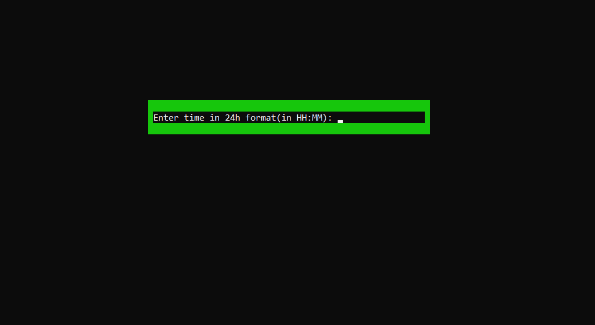

# Task Manager
<b>Manage your tasks and events</b>   
To change the save file, change the <i>const string SaveFile </i> at line 13  in TaskManager.cs 

Here are some previews:

         

   

     

<B><I>Have fun!</B></I>
